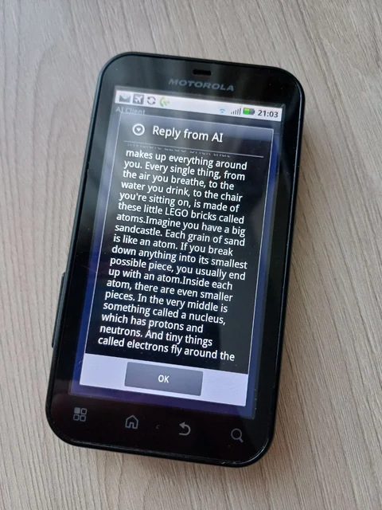
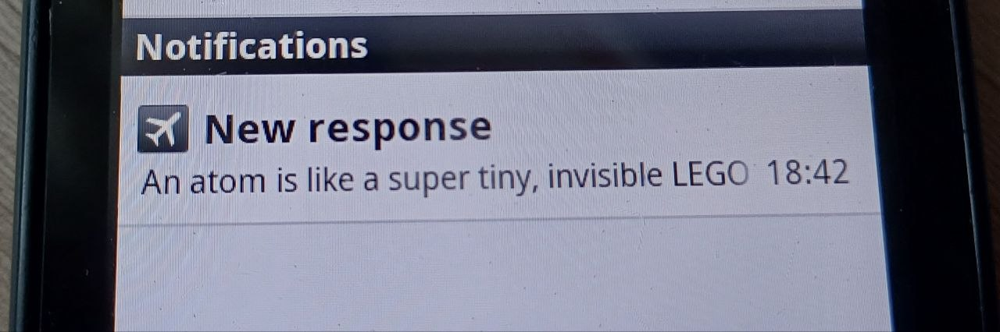

# AI on Froyo

Read more about this [here](https://blog.olehsheremeta.com/blog/ai-on-android-froyo/)

## What is this?

This was small experiment to see how I would run AI chat bot on device from 2010. This app is nothing special. It retains conversation history temporarily for the model (in RAM) and uses HTTP to talk to proxy (Python script) and proxy talks to Gemini API.

To compile, open this project in Eclipse Juno with Android SDK for Android 2.2 installed and "Run as Android Application". Then launch ```proxy.py```.

Only things to update in code for you are:
- your Gemini API key in ```proxy.py```
- IP Adress and port (local) inside ```src\PostTask.java```

## Some pictures


